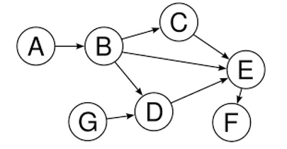
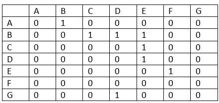

# ΑΣΚΗΣΕΙΣ ΣΤΟ ΜΑΘΗΜΑ ΔΟΜΕΣ ΔΕΔΟΜΕΝΩΝ ΚΑΙ ΑΛΓΟΡΙΘΜΟΙ (ΕΡΓΑΣΤΗΡΙΟ) DITUOI_2019_2020

## 2019-2020 (ΧΕΙΜΕΡΙΝΟ ΕΞΑΜΗΝΟ)

### ΣΕΤ 1 - ΑΣΚΗΣΗ 1

Να γράψετε πρόγραμμα που να γεμίζει έναν πίνακα 100 θέσεων με τυχαίες ακέραιες τιμές στο διάστημα [0,1000]. Κατασκευάστε μια συνάρτηση που να δέχεται τον πίνακα ως παράμετρο και να επιστρέφει τη μέση τιμή, τη μικρότερη τιμή και τη μεγαλύτερη τιμή του πίνακα. Εμφανίστε στη main τα αποτελέσματα.

#### ΛΥΣΗ ΣΕΤ1 ΑΣΚΗΣΗ 1

- Κώδικας: [y19s1e1.cpp](./y19s1e1.cpp)
  - Μεταγλώττιση: $ g++ y19s1e1.cpp -o y19s1e1 -std=c++11 -Wall
  - Εκτέλεση: $ ./y19s1e1
  - Εκτέλεση και καταγραφή της εξόδου σε αρχείο: $ ./y19s1e1 > y19s1e1.out
- Έξοδος: [y19s1e1.out](./y19s1e1.out)

### ΣΕΤ 1 - ΑΣΚΗΣΗ 2

Γράψτε πρόγραμμα που να διαβάζει το CSV αρχείο «Population Figures By Country» <https://datahub.io/JohnSnowLabs/population-figures-by-country> με στοιχεία πληθυσμού κρατών στο διάστημα 1960-2016 και να τα τοποθετεί σε κατάλληλους πίνακες. Στη συνέχεια για κάθε χώρα να εμφανίζει το όνομά της και το έτος στο οποίο είχε τη μεγαλύτερη μεταβολή πληθυσμού.

#### ΛΥΣΗ ΣΕΤ 1 ΑΣΚΗΣΗ 2

- Δεδομένα: [Δεδομένα1 (αρχικά)](./population-figures-by-country-csv_csv.csv)
- Κώδικας: [y19s1e2.cpp](./y19s1e2.cpp)
  - Μεταγλώττιση: $ g++ y19s1e2.cpp -o y19s1e2 -std=c++11 -Wall
  - Εκτέλεση και καταγραφή της εξόδου σε αρχείο: $ ./y19s1e2 > y19s1e2.out
- Έξοδος: [y19s1e2.out](./y19s1e2.out)
- Δεδομένα: [Δεδομένα2 (χωρίς "δύσκολες" εγγραφές)](./population-figures-easy.csv)
- Κώδικας: [y19s1e2_easy.cpp](./y19s1e2_easy.cpp)
  - Μεταγλώττιση: $ g++ y19s1e2_easy.cpp -o y19s1e2_easy -std=c++11 -Wall
  - Εκτέλεση και καταγραφή της εξόδου σε αρχείο: $ ./y19s1e2_easy > y19s1e2_easy.out
- Έξοδος: [y19s1e2_easy.out](./y19s1e2_easy.out)

### ΣΕΤ 2 - ΑΣΚΗΣΗ 1

Γράψτε ένα πρόγραμμα που να διαβάζει όλες τις λέξεις ενός αρχείου κειμένου και να εμφανίζει πόσες φορές υπάρχει η κάθε λέξη στο κείμενο σε αύξουσα σειρά συχνότητας. Χρησιμοποιήστε ως είσοδο το κείμενο του βιβλίου 1984 του George Orwell (http://gutenberg.net.au/ebooks01/0100021.txt). Πριν καταμετρηθεί κάθε λέξη τα γράμματα από τα οποία αποτελείται θα πρέπει να μετατρέπονται σε κεφαλαία.

#### ΛΥΣΗ ΣΕΤ 2 ΑΣΚΗΣΗ 1

- Δεδομένα: [1984.txt](./1984.txt)
- Απόσπασμα δεδομένων: [1984_small.txt](./1984_small.txt)
- Κώδικας (1η λύση): [y19s2e1_a.cpp](./y19s2e1_a.cpp)
  - Μεταγλώττιση: $ g++ y19s2e1_a.cpp -o y19s2e1_a -std=c++11 -Wall
  - Εκτέλεση και καταγραφή της εξόδου σε αρχείο: $ ./y19s2e1_a > y19s2e1.out
- Κώδικας (2η λύση με χρήση std::pair, std::transform και lambda συνάρτησης για την ταξινόμηση): [y19s2e1_b.cpp](./y19s2e1_b.cpp)
  - Μεταγλώττιση: $ g++ y19s2e1_b.cpp -o y19s2e1_b -std=c++11 -Wall
  - Εκτέλεση και καταγραφή της εξόδου σε αρχείο: $ ./y19s2e1_b > y19s2e1.out
- Κώδικας (3η λύση, παραλλαγή της 2ης με είσοδο του ονόματος του αρχείου ως command line argument): [y19s2e1_c.cpp](./y19s2e1_c.cpp)
  - Μεταγλώττιση: $ g++ y19s2e1_c.cpp -o y19s2e1_c -std=c++11 -Wall
  - Εκτέλεση και καταγραφή της εξόδου σε αρχείο: $ ./y19s2e1_c 1984.txt > y19s2e1.out
- Κώδικας (4η λύση, παραλλαγή της 2ης με ανακατεύθυνση των δεδομένων εισόδου προς το εκτελέσιμο: [y19s2e1_d.cpp](./y19s2e1_d.cpp)
  - Μεταγλώττιση: $ g++ y19s2e1_d.cpp -o y19s2e1_d -std=c++11 -Wall
  - Εκτέλεση και καταγραφή της εξόδου σε αρχείο: $ ./y19s2e1_d < 1984.txt > y19s2e1.out
- Έξοδος: [y19s2e1.out](./y19s2e1.out)

### ΣΕΤ 2 ΑΣΚΗΣΗ 2 (α' μέρος)

Υλοποιήστε μια διπλά συνδεδεμένη λίστα (double_linked_list) που να υποστηρίζει τις ακόλουθες λειτουργίες: εισαγωγή στοιχείου στην αρχή (insert_front), εισαγωγή στοιχείου στο τέλος (insert_back), διαγραφή στοιχείου βάσει αναγνωριστικού (erase), εμφάνιση στοιχείων λίστας από την αρχή προς το τέλος (print_forward), εμφάνιση στοιχείων λίστας από το τέλος προς την αρχή (print_reverse). Στη συνέχεια:

1. Διαβάστε υποθετικά δεδομένα φοιτητών και φοιτητριών από το αρχείο κειμένου (students.txt) και τοποθετήστε τις εγγραφές σε μια διπλά συνδεδεμένη λίστα. Θεωρείστε ότι η γραμμογράφηση του αρχείου είναι η ακόλουθη: <κωδικός> <όνομα> <εξάμηνο> <κατεύθυνση> <βαθμός>. Εμφανίστε τη λίστα από την αρχή προς το τέλος.
2. Εισάγετε στην αρχή της λίστας την εγγραφή "011 iasonas 3 CS 7.0" και στο τέλος της λίστας εισάγετε την εγγραφή "012 electra  5 CE 6.0".
3. Διαγράψτε την εγγραφή με κωδικό 005. Εμφανίστε τη λίστα από την αρχή προς το τέλος.
4. Διατηρείστε στη λίστα μόνο τους φοιτητές και τις φοιτήτριες από την κατεύθυνση CS με βαθμό από 5 και πάνω. Εμφανίστε όλες τις εγγραφές της λίστας από το τέλος προς την αρχή.

### ΣΕΤ 2 ΑΣΚΗΣΗ 2 (β' μέρος)

Επαναλάβετε τα παραπάνω βήματα (1-4) χρησιμοποιώντας τη δομή διπλά συνδεδεμένης λίστας που παρέχει η STL.

#### ΛΥΣΗ ΣΕΤ 2 ΑΣΚΗΣΗ 2 (α' μέρος, υλοποίηση με διπλά συνδεδεμένη λίστα)

- Δεδομένα: [students.txt](./students.txt)
- Κώδικας: [y19s2e2a.cpp](./y19s2e2a.cpp)
  - Μεταγλώττιση: $ g++ y19s2e2a.cpp -o y19s2e2a -std=c++11 -Wall
  - Εκτέλεση: $ ./y19s2e2a < students.txt > y19s2e2a.out
- Έξοδος: [y19s2e2a.out](./y19s2e2a.out)

#### ΛΥΣΗ ΣΕΤ 2 ΑΣΚΗΣΗ 2 (β' μέρος, υλοποίηση με διπλά συνδεδεμένη λίστα της STL)

- Κώδικας: [y19s2e2b.cpp](./y19s2e2b.cpp)
  - Μεταγλώττιση: $ g++ y19s2e2b.cpp -o y19s2e2b -std=c++11 -Wall
  - Εκτέλεση: $ ./y19s2e2b < students.txt > y19s2e2b.out
- Έξοδος: [y19s2e2b.out](./y19s2e2b.out)

### ΣΕΤ 3 - ΑΣΚΗΣΗ 1

Γράψτε ένα πρόγραμμα που να δημιουργεί ένα απλό blockchain. Το blockchain είναι μια αλυσίδα από μπλοκς για τα οποία ισχύει ότι το hash του προηγούμενου μπλοκ καταγράφεται ως πληροφορία στο τρέχον μπλοκ. Υλοποιήστε το blockchain σύμφωνα με τις ακόλουθες οδηγίες:

1. Κάθε μπλοκ του blockchain να είναι ένα struct που να αποτελείται από τα εξής στοιχεία: id (τύπου size_t), timestamp (τύπου string), data (τύπου string), nonce (τύπου size_t) και previous_hash (τύπου size_t). 
2. Να γράψετε συνάρτηση size_t hash_combined(block &a_block)  που να επιστρέφει το hash ενός μπλοκ ως hash του λεκτικού που προκύπτει από τη συνένωση ως ένα λεκτικό των επιμέρους στοιχείων του μπλοκ. Για τον υπολογισμό του hash του λεκτικού να χρησιμοποιηθεί η std::hash.
3. Να γράψετε συνάρτηση void find_nonce(block &a_block, int difficulty) που να αλλάζει την τιμή του πεδίου nonce του a_block (ξεκινώντας από το 0 και δοκιμάζοντας διαδοχικά τιμές που αυξάνονται κατά 1) έτσι ώστε η hash τιμή του block να έχει τόσα συνεχόμενα μηδενικά στο τέλος όσα η τιμή της μεταβλητής difficulty.
4. Το αρχικό μπλοκ να έχει τα εξής στοιχεία: {0, <τρέχουσα ημερομηνία και ώρα>, “GENESIS BLOCK”, <nonce>, 0} και να τοποθετείται σε μια std::list της STL. Η <τρέχουσα ημερομηνία και ώρα> να καταγράφεται ως YYYY-MM-DD HH:MM:SS. Το nonce να υπολογίζεται με difficulty=7.
5. Να συμπληρωθούν 7 επιπλέον μπλοκς έτσι ώστε το blockchain το οποίο θα έχει δημιουργηθεί με difficulty=7 να περιέχει πληροφορία αντίστοιχη με την ακόλουθη.

```sh
    id: 0 
    ts: 2019-12-01 12:37:15 
    data: GENESIS block 
    nonce: 7705472
    p_hash: 0
    hash: 7409222825570000000

    id: 1 
    ts: 2019-12-01 12:37:24 
    data: Alice pays 10 euros to Bob 
    nonce: 20662197 
    p_hash: 7409222825570000000 
    hash: 14415237325170000000

    id: 2 
    ts: 2019-12-01 12:37:55 
    data: Bob pays 5 euros to Carl 
    nonce: 4180543 
    p_hash: 14415237325170000000 
    hash: 9785420976540000000

    id: 3 
    ts: 2019-12-01 12:38:02 
    data: Carl pays 10 euros to David 
    nonce: 3124703 
    p_hash: 9785420976540000000 
    hash:15500881473790000000

    id: 4 ts:2019-12-01 12:38:07 
    data: David pays 2 euros to Alice 
    nonce: 11311765 
    p_hash: 15500881473790000000 
    hash:17403203628000000000

    id: 5 
    ts: 2019-12-01 12:38:24 
    data: Alice pays 2 euros to Bob 
    nonce: 28602793 
    p_hash: 17403203628000000000 
    hash:847005160950000000

    id: 6 
    ts: 2019-12-01 12:39:08 
    data: Bob pays 5 euros to David 
    nonce: 5567229 
    p_hash: 847005160950000000 
    hash:10509950750660000000

    id: 7 
    ts: 2019-12-01 12:39:17 
    data: Carl pays 5 euros to Alice 
    nonce: 6164283 
    p_hash: 10509950750660000000 
    hash:11846123523500000000
```

6. Να γράψετε συνάρτηση bool check_valid_blockchain(list<block> &chain) που να επιστρέφει εάν το blockchain είναι έγκυρο ή όχι, εξετάζοντας την καταγεγραμμένη τιμή του previous_hash σε κάθε μπλοκ  με την hash τιμή του προηγούμενου μπλοκ. Ελέγξτε την εγκυρότητα του blockchain.
7. Αλλάξτε το προτελευταίο block έτσι ώστε να περιέχει ως data το κείμενο «Bob pays 5000 euros to David» και ελέγξτε εκ νέου την εγκυρότητα του blockchain.

#### ΛΥΣΗ ΣΕΤ 3 ΑΣΚΗΣΗ 1

- Κώδικας: [y19s3e1.cpp](./y19s3e1.cpp)
  - Μεταγλώττιση: $ g++ y19s3e1.cpp -o y19s3e1 -std=c++11 -Wall
  - Εκτέλεση: $ ./y19s3e1
- Έξοδος: [y19s3e1.out](./y19s3e1.out)

### ΣΕΤ 3 - ΑΣΚΗΣΗ 2

Υλοποιήστε τον αλγόριθμο του Kahn  για τοπολογική ταξινόμηση κατευθυνόμενων ακυκλικών γραφημάτων (Directed Acyclic Graphs). Θεωρείστε ότι τα γραφήματα καταγράφονται σε πίνακες γειτνίασης. Για παράδειγμα το γράφημα του σχήματος κάτω αριστερά καταγράφεται ως  ο πίνακας κάτω δεξιά.






Ειδικότερα, αναπτύξτε ένα πρόγραμμα που:

1. Διαβάζει αρχείο στο οποίο είναι αποθηκευμένο ένα DAG.
2. Εφαρμόζει τον αλγόριθμο τοπολογικής ταξινόμησης του Kahn και καταγράφει τα αποτελέσματα σε αρχείο.

#### ΛΥΣΗ ΣΕΤ 3 ΑΣΚΗΣΗ 2

- Κώδικας: [y19s3e2.cpp](./y19s3e2.cpp)
  - Μεταγλώττιση: $ g++ y19s3e2.cpp -o y19s3e2 -std=c++11 -Wall
  - Εκτέλεση: $ ./y19s3e2
- Έξοδος: [y19s3e2.out](./y19s3e2.out)
